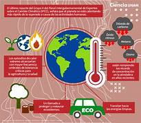
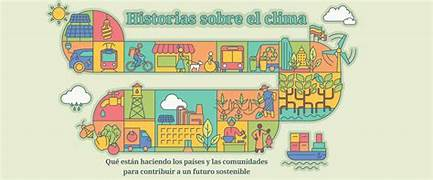

# ECOLIFE_CLIMATIC

https://www.youtube.com/watch?v=enKGpyPQpp8&pp=ygUWdmlkZW8gRUNPTElGRV9DTElNQVRJQw%3D%3D

## PROBLEMA🤷‍♂️
El cambio climático y la degradación ambiental son problemas globales que requieren acciones inmediatas. Sin embargo, la falta de conciencia y educación sobre sostenibilidad y cuidado del medio ambiente en la población general es un obstáculo significativo para lograr un impacto positivo. La información disponible es a menudo confusa, desactualizada o inaccesible, lo que dificulta la adopción de prácticas sostenibles.

## SOLUCION🤠
EcoLife es una app móvil que busca educar y concienciar a los usuarios sobre prácticas sostenibles y cuidado del medio ambiente, mediante un sistema de recompensas y desafíos. La app ofrece:
- Información actualizada y confiable sobre sostenibilidad y cuidado del medio ambiente
- Un sistema de recompensas y desafíos para motivar a los usuarios a adoptar prácticas sostenibles
- Una comunidad de usuarios que pueden compartir experiencias y consejos
- Un directorio de productos y servicios sostenibles

## ACTORES🤵‍♂️🤵‍♀️🧙
 -Usuarios: personas que descargan y utilizan la app
- Administradores: personas que gestionan y actualizan el contenido de la app
- Empresas sostenibles: empresas que ofrecen productos y servicios sostenibles y desean promocionarlos en la app

## HISTORIAS DE USUARIO📜📙
- Como usuario, quiero poder registrar mis acciones sostenibles para recibir recompensas y desafíos
- Como usuario, quiero poder acceder a información y recursos sobre sostenibilidad y cuidado del medio ambiente
- Como usuario, quiero poder unirme a una comunidad de personas que comparten mis intereses en sostenibilidad
- Como administrador, quiero poder agregar y actualizar contenido sobre sostenibilidad y cuidado del medio ambiente
- Como empresa sostenible, quiero poder promocionar mis productos y servicios en la app 

## MAPA DE NAVEGACION🌍🗺️
- Pantalla de inicio: registro y login
- Pantalla de acciones sostenibles: registro de acciones y visualización de recompensas y desafíos
- Pantalla de recursos: acceso a información y recursos sobre sostenibilidad y cuidado del medio ambiente
- Pantalla de comunidad: foro de discusión y compartir experiencias
- Pantalla de directorio: búsqueda y visualización de productos y servicios sostenibles
- Pantalla de administración: gestión de contenido y usuarios

 

## DIAGRAMA DE CASOS DE USO📱📟
- Registro de usuario
- Registro de acciones sostenibles
- Visualización de recompensas y desafíos
- Acceso a recursos
- Unirse a la comunidad
- Publicar en el foro
- Buscar productos y servicios sostenibles
- Gestión de contenido y usuarios

## PATRON DE ARQUITECTURA🤵‍♂️📱

**PATRON DE ARQUITECTURA MICROSERVICIOS**

1. **Independencia** : Cada microservicio es una unidad independiente que puede ser desarrollada, desplegada y escalada de manera autónoma.

2. **Organización en torno a la funcionalidad**: Los microservicios se organizan en torno a la funcionalidad de negocio, no en torno a la tecnología.

3. **Comunicación a través de APIs**: Los microservicios se comunican entre sí utilizando APIs y protocolos de red.

4. **Desarrollo y despliegue autónomos**: Cada microservicio puede ser desarrollado y desplegado de manera autónoma, sin afectar a los demás servicios.

5. **Escalabilidad**: Los microservicios pueden ser escalados de manera independiente, según las necesidades de cada servicio.

6. **Tolerancia a fallos**: Si un microservicio falla, no afecta a los demás servicios, lo que mejora la tolerancia a fallos.

7. **Flexibilidad tecnológica**: Cada microservicio puede ser desarrollado utilizando diferentes tecnologías y lenguajes de programación.

### Ventajas de la arquitectura de microservicios:

1. Mayor flexibilidad y escalabilidad

2. Mejora la tolerancia a fallos

3. Permite el desarrollo y despliegue autónomos

4. Mejora la colaboración y el trabajo en equipo

5. Permite la utilización de diferentes tecnologías

### Desventajas de la arquitectura de microservicios:

1. Complejidad adicional

2. Necesidad de una buena gestión de APIs

3. Necesidad de una buena gestión de datos

4. Necesidad de una buena gestión de la seguridad

5. Necesidad de una buena monitorización y logging 

**En resumen, la arquitectura de microservicios es un enfoque de diseño de software que ofrece flexibilidad, escalabilidad y tolerancia a fallos, pero requiere una buena gestión de APIs, datos, seguridad, monitorización y logging**.